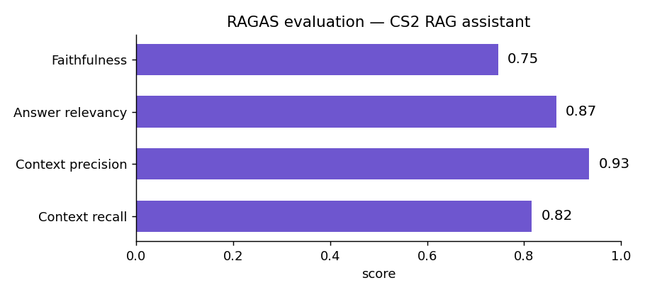

# CS2 RAG Assistant

## 📌 Project Overview
This project is a Retrieval-Augmented Generation (RAG) assistant for
**Counter-Strike 2**. It answers questions about weapons and the economy, map
callouts, utility and CS2's smoke mechanics, round rules, and strategy — and
every answer is **grounded in a curated knowledge base with the source passages
cited inline**, so you can see exactly what each claim is based on and when the
assistant doesn't know.

It is the standalone successor to an earlier TF-IDF / intent-classifier CS2
chatbot: the same domain, rebuilt as a real retrieval stack with hybrid search,
a cross-encoder reranker, grounded generation, and an offline evaluation.

**Domain**: Counter-Strike 2 — weapons, economy, maps, utility, rules, strategy.  
**Stack**: `bge-m3` embeddings, Qdrant, BM25, `bge-reranker-v2-m3`,
`Qwen2.5-3B-Instruct`, FastAPI, Streamlit, RAGAS.  
**Goal**: Accurate, grounded, cited answers from a small curated corpus — and
back it with real evaluation numbers.

---

## 🚀 Key Features
1. **Hybrid Retrieval (not naive top-k)**:
   - A dense search with **bge-m3** embeddings in **Qdrant** and a lexical
     **BM25** search run in parallel.
   - Their rankings are merged with **Reciprocal Rank Fusion**, so a query is
     matched on both meaning and on exact terms like weapon names and callouts.
2. **Cross-Encoder Reranking**:
   - The fused candidates are re-scored by a **bge-reranker-v2-m3** cross-encoder
     that reads the query and passage together, which is far more precise than
     the first-stage scores.
3. **Grounded Generation with Citations**:
   - The top passages are handed to an instruct model that answers **only** from
     them and cites each claim inline as `[n]`.
   - When the passages don't cover the question, it says so instead of guessing.
4. **Offline Evaluation**:
   - A hand-written question set is scored with **RAGAS** — faithfulness, answer
     relevancy, context precision and recall — fully offline with a local judge.
5. **Runs Locally or in Docker**:
   - Local embeddings and a local LLM by default, with no paid API.
   - `docker compose up` brings up Qdrant + the API + the Streamlit UI.

---

## 🔍 Findings
Evaluated on a 38-question set with [RAGAS](https://docs.ragas.io), scored
entirely offline with a local judge (`Qwen2.5-3B-Instruct`, 4-bit):

- **Context Precision**: **0.93** — retrieval surfaces the right passages.
- **Context Recall**: **0.82** — coverage across the full 38 questions.
- **Answer Relevancy**: **0.87** — answers stay on the question (35/38 scored).
- **Faithfulness**: **0.75** — answers stick to the retrieved context (19/38 scored).



Context recall and answer relevancy parse cleanly across the whole set. The
stricter faithfulness and context-precision metrics are averaged over the
questions the small local judge could score cleanly; pointing a larger or hosted
judge at the same cached generations (`python -m eval.run_eval --reuse`) closes
that gap. Full write-up in [eval/results.md](eval/results.md) — every number is
reproducible from a real run, none are hand-set.

---

## 🧩 How It Works
1. **Ingest** — the markdown corpus is split section-aware into ~200–300 token
   chunks that carry their source file and heading, so answers can cite them.
2. **Index** — chunks are embedded with bge-m3 into Qdrant, and a BM25 index is
   built alongside for lexical matching.
3. **Retrieve** — dense top-k and BM25 top-k are fused with Reciprocal Rank
   Fusion, then reranked by the cross-encoder down to the top few passages.
4. **Answer** — the passages are numbered and given to the LLM, which answers
   from them with `[n]` citations, or declines when the context is thin.

A real exchange through the API:

```text
Q: What is the loss bonus ladder and how much is the bomb plant bonus?

A: The loss bonus ladder goes up to $3400, starting from $1400 and increasing
   by $500 after each consecutive loss. [2] Planting the bomb gives the team an
   $800 bonus even on a round it loses. [1]

   [1] economy-rewards.md › The plant bonus   (rerank 0.98)
   [2] economy-rewards.md › overview          (rerank 0.79)
```

Out-of-scope questions are declined rather than answered from outside the
corpus (e.g. "Who is the best NBA player of all time?" → "I don't have enough
information to answer that."). The Streamlit UI shows the answer with an
expandable **Sources** panel that marks which passages were cited and lists each
one's dense, BM25 and reranker scores.

---

## ⚙️ How to Run
### Docker
```bash
docker compose up --build
```
Starts Qdrant, builds the index from the corpus, serves the API on `:8000` and
the Streamlit chat on `:8501`. Models download on first run into a cached
volume; open http://localhost:8501.

### Local
```bash
python -m venv .venv && source .venv/bin/activate
pip install -r requirements.txt

python -m scripts.build_index          # chunk, embed, build BM25 + Qdrant
uvicorn app.api:app --port 8000        # API
streamlit run app/ui.py                # UI (in a second shell)
```
A CUDA GPU is used automatically if present (set `LLM_4BIT=1` to load the
generator in 4-bit on an 8 GB card); everything also runs on CPU, just slower.

Swapping in a hosted model is one change: set `LLM_PROVIDER=openai`,
`OPENAI_BASE_URL`, `OPENAI_API_KEY` and `GEN_MODEL`.

---

## 🛠 System Requirements
- Python 3.11+
- Key libraries: `sentence-transformers`, `transformers`, `qdrant-client`,
  `rank-bm25`, `fastapi`, `streamlit`, `ragas` (full list in `requirements.txt`)
- Optional: Docker and Docker Compose; an NVIDIA GPU for faster local inference

---

## 📄 License
This project is licensed under the MIT License. See the [LICENSE](LICENSE) file
for details.
