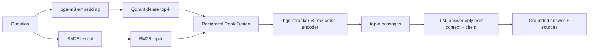

# CS2 RAG Assistant


A retrieval-augmented assistant that answers Counter-Strike 2 questions —
weapons and economy, map callouts, utility, round rules and basic strategy —
grounded in a small curated knowledge base, with the source passages cited
inline. Ask a question in the chat and you get an answer that only uses what the
retriever found, with `[n]` citations you can expand and check.

It is the standalone successor to an older TF-IDF/intent-classifier CS2 chatbot:
same domain, but a real retrieval stack this time — hybrid search, a
cross-encoder reranker, grounded generation, and an offline evaluation with
numbers.

## Example

A real exchange through the API (`GEN_MODEL=Qwen/Qwen2.5-3B-Instruct`, 4-bit):

```text
Q: What is the loss bonus ladder and how much is the bomb plant bonus?

A: The loss bonus ladder goes up to $3400, starting from $1400 and increasing
   by $500 consecutively after each loss. [2] The plant bonus is $800 regardless
   of where the bomb is planted, even if the round is lost. [1]

Sources
  [1] economy-rewards.md › The plant bonus   (rerank 0.98)
  [2] economy-rewards.md › overview          (rerank 0.79)
  [3] bomb-objectives.md › The C4            (rerank 0.44)
  [4] utility-grenades.md › overview         (rerank 0.02)
```

Out-of-scope questions are declined instead of answered from outside the corpus:

```text
Q: Who is the best NBA player of all time?
A: I don't have enough information to answer that.
```

The Streamlit UI shows the same answer with an expandable **Sources** panel that
marks which passages the answer actually cited and lists each one's dense, BM25
and reranker scores.

## Architecture



The retrieval path is deliberately not naive top-k cosine:

- **Hybrid retrieval** — a dense search (bge-m3 embeddings in Qdrant) and a
  lexical BM25 search run in parallel and are combined with **Reciprocal Rank
  Fusion**, so a question is matched both on meaning and on exact terms like
  weapon names and callouts.
- **Reranking** — the fused candidates are re-scored by a `bge-reranker-v2-m3`
  cross-encoder, which reads the query and passage together and is far more
  precise than the first-stage scores.
- **Grounded generation** — the top passages are handed to an instruct model
  that is told to answer *only* from them, cite the passages it uses as `[n]`,
  and say it doesn't know when the passages don't cover the question.

The retrieval layer in [`src/retrieve.py`](src/retrieve.py) is import-clean and
self-contained so it can be reused outside this project.

## Results

The pipeline is evaluated offline with [RAGAS](https://docs.ragas.io) over a
hand-written question set in [`eval/questions.yaml`](eval/questions.yaml). Full
write-up in [`eval/results.md`](eval/results.md).


| Metric | Score | Scored |
|--------|------:|-------:|
| Faithfulness | 0.75 | 19/38 |
| Answer relevancy | 0.87 | 35/38 |
| Context precision | 0.93 | 15/38 |
| Context recall | 0.82 | 38/38 |

Scored entirely offline with a local judge (`Qwen2.5-3B-Instruct`, 4-bit) so the
evaluation runs without a paid API. A judge that small doesn't always return
RAGAS's stricter structured-output prompts in a parseable form, so faithfulness
and context precision are averaged over the questions it scored cleanly (the
*Scored* column); context recall and answer relevancy parse reliably over all
38. Re-running the cached generations through a stronger judge
(`run_eval.py --reuse` with `LLM_PROVIDER=openai`) closes that gap — these are a
reproducible local baseline, not a ceiling.

## Quickstart

### Docker (vector store + API + UI)

```bash
docker compose up --build
```

This starts Qdrant, builds the index from the corpus, serves the API on
`:8000`, and the Streamlit chat on `:8501`. Models download on first run into a
cached volume. Open http://localhost:8501.

### Local (Python)

```bash
python -m venv .venv && source .venv/bin/activate
pip install -r requirements.txt

python -m scripts.build_index            # chunk, embed, build BM25 + Qdrant
uvicorn app.api:app --port 8000          # API
streamlit run app/ui.py                  # UI (separate shell)
```

A CUDA GPU is used automatically if present. On an 8 GB GPU the embedder and
reranker run in fp16 and the generator in 4-bit (`LLM_4BIT=1`); everything also
runs on CPU, just slower.

## How it works

| Stage | What happens | Where |
|-------|--------------|-------|
| Ingest | Markdown is split section-aware into ~200–300 token chunks that keep their source file and heading for citations | [`src/ingest.py`](src/ingest.py) |
| Embed + store | `bge-m3` embeddings go into Qdrant (local on-disk by default, a server in Docker); a `rank_bm25` index is built alongside | [`src/embed.py`](src/embed.py), [`src/store.py`](src/store.py) |
| Retrieve | Dense + BM25 → RRF → cross-encoder rerank → top-n passages | [`src/retrieve.py`](src/retrieve.py) |
| Generate | Prompt the model with numbered passages; answer with inline `[n]` citations or decline | [`src/llm.py`](src/llm.py), [`src/rag.py`](src/rag.py) |
| Evaluate | RAGAS faithfulness / answer relevancy / context precision / recall | [`eval/run_eval.py`](eval/run_eval.py) |

## Configuration

Everything is overridable by environment variable (see
[`src/config.py`](src/config.py)):

| Variable | Default | Purpose |
|----------|---------|---------|
| `EMBED_MODEL` | `BAAI/bge-m3` | embedding model |
| `RERANK_MODEL` | `BAAI/bge-reranker-v2-m3` | cross-encoder reranker |
| `GEN_MODEL` | `Qwen/Qwen2.5-3B-Instruct` | generator |
| `LLM_PROVIDER` | `hf` | `hf` (local) or `openai` (compatible endpoint) |
| `QDRANT_URL` | _(unset)_ | use a Qdrant server instead of local on-disk |
| `LLM_4BIT` | _(unset)_ | set to `1` to load the generator in 4-bit |
| `DENSE_K` / `BM25_K` / `RERANK_TOP_N` | 20 / 20 / 5 | retrieval depths |

Swapping in a hosted model is one change: set `LLM_PROVIDER=openai`,
`OPENAI_BASE_URL`, `OPENAI_API_KEY`, and `GEN_MODEL`.

## Layout

```
data/corpus/   curated CS2 notes (markdown)
src/           ingest, embed, store, retrieve, llm, rag
app/           FastAPI service + Streamlit chat
eval/          question set, RAGAS runner, committed results
scripts/       build_index
```

## Knowledge base

The corpus is a few hundred KB of hand-written notes covering weapons and
prices, the economy and buy logic, utility and CS2 smoke mechanics, map
callouts for the active-duty maps, round rules and the MR12 format, roles, and
common strategies. It is intentionally small and curated rather than scraped;
facts are paraphrased into our own words.
